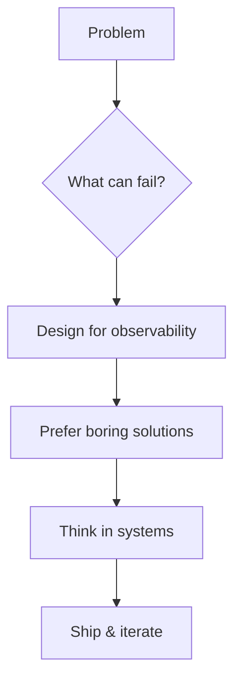
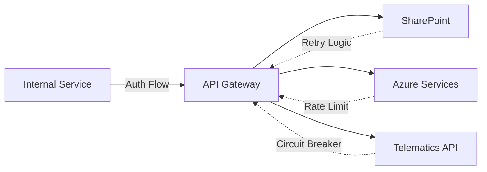
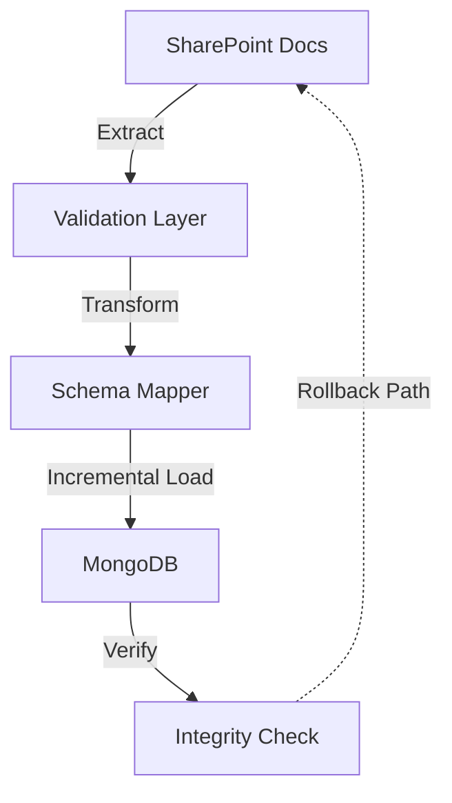
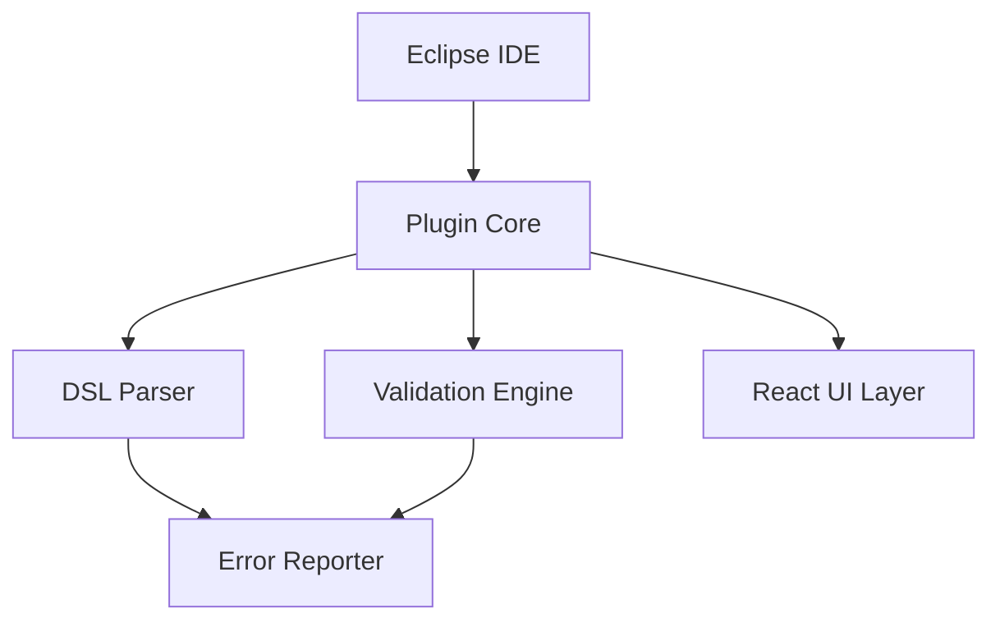
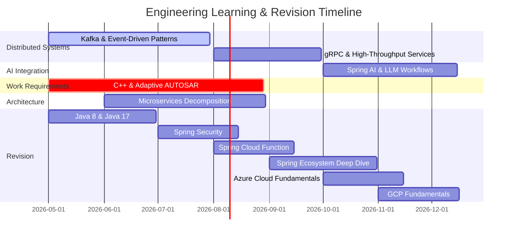
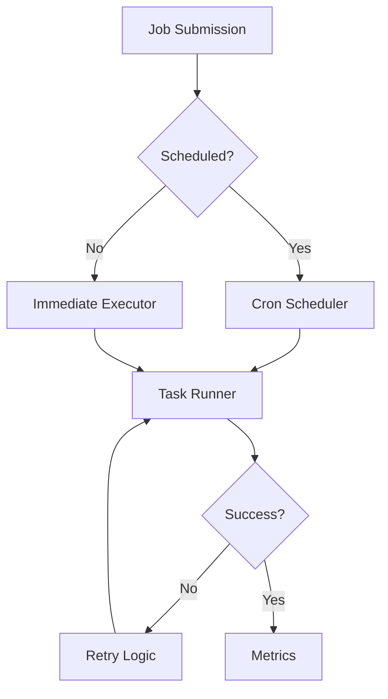
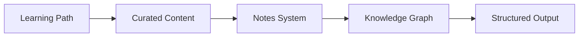

<div align="center">


# Ankit Rai

**Backend Engineer · Systems Thinker · Building for Scale & Reliability**

<p align="center">
  <em>I design backend systems that survive production — integrations that handle enterprise complexity,<br/>APIs that scale predictably, and architectures that stay maintainable under real-world constraints.</em>
</p>

<p align="center">
  <a href="https://github.com/SudegoraAnkit">
    
  </a>
  <a href="https://linkedin.com/in/ankitsudegora">
    
  </a>
</p>

# 📊 GitHub Stats:
<br/>
<br/>


</div>

---

## 🎯 What I Bring to Engineering

<table>
<tr>
<td width="50%">

### 💡 Engineering Mindset



</td>
<td width="50%">

### 🎪 Current Focus

- **Distributed Systems Thinking**  
  Kafka, event-driven patterns, eventual consistency

- **API Design & Integration**  
  REST, gRPC, async messaging, failure recovery

- **AI-Integrated Backends**  
  LLM tool chains, Spring AI, augmented services

- **Production Java/Spring**  
  Enterprise-grade reliability & observability

</td>
</tr>
</table>

**My Engineering Approach:**
```
Start with constraints → Design for observability → Ship boring solutions → Think in systems
```

---

## 💼 Engineering Experience

<div align="center">

### 🏗️ **Enterprise Backend Architecture**

</div>

<table>
<tr>
<td width="60%">

#### **API Integration Architecture**

Built enterprise API integrations connecting internal services with SharePoint, Azure, and third-party telematics platforms.

**Key Engineering Decisions:**
- Designed retry logic with exponential backoff for flaky external APIs
- Built correlation IDs across distributed calls for debugging
- Instrumented integration points before optimizing

**Tech Context:** Spring Boot, REST, MSSQL, MongoDB, Azure

</td>
<td width="40%">



</td>
</tr>
</table>

---

<table>
<tr>
<td width="40%">



</td>
<td width="60%">

#### **Large-Scale Data Migration System**

Architected SharePoint → MongoDB migration pipeline for enterprise document management.

**System Properties:**
- Incremental migration with rollback capability
- Zero-downtime cutover strategy
- Schema transformation with integrity validation

**Learning Applied:** Studying Kafka to improve future event-driven migration patterns

**Tech Context:** Java, Spring Boot, MongoDB, SharePoint API

</td>
</tr>
</table>

---

<table>
<tr>
<td width="60%">

#### **Eclipse Plugin Tooling & DSL Systems**

Built Eclipse RCP-based validation tooling for domain-specific languages in enterprise environments.

**Architecture Highlights:**
- Plugin-based extensibility model
- Integrated React UI into Eclipse RCP
- DSL validation engine with real-time feedback

**Tech Context:** Java, Eclipse RCP, React integration

</td>
<td width="40%">



</td>
</tr>
</table>

---

## 🔬 Active Learning (Applied to Real Problems)

<div align="center">

### 📚 Learning Integrated with Engineering Work

</div>



<table>
<tr>
<th>Learning Track</th>
<th>Applied Context</th>
<th>Status</th>
</tr>
<tr>
<td>🔄 <b>Kafka & Event-Driven Systems</b></td>
<td>Rethinking migration pipelines and async integration patterns</td>
<td></td>
</tr>
<tr>
<td>⚡ <b>gRPC & Spring WebFlux</b></td>
<td>Evaluating for high-throughput internal service communication</td>
<td></td>
</tr>
<tr>
<td>🤖 <b>Spring AI & LLM Integration</b></td>
<td>Exploring AI-augmented backend workflows and tool orchestration</td>
<td></td>
</tr>
<tr>
<td>🚗 <b>C++ & Adaptive AUTOSAR</b></td>
<td>Current work requirement — embedded systems context</td>
<td></td>
</tr>
<tr>
<td>🏢 <b>Microservices Decomposition</b></td>
<td>Applying to legacy modernization and bounded context design</td>
<td></td>
</tr>
</table>

**Revising Fundamentals:** DSA · Low-Level Design · High-Level Design *(interview prep + deeper systems thinking)*

---

## 🚀 Projects That Show My Thinking

<div align="center">

### 🛠️ **Active Development**

</div>

<table>
<tr>
<td width="50%">

### **[Lumina Task Orchestrator](https://github.com/SudegoraAnkit/lumina-task-orchestrator)**

 

Lightweight workflow orchestrator for scheduled and ad-hoc job execution.

**Engineering Focus:**
- Task scheduling & dependency management
- Failure recovery with retry strategies
- Built-in observability and monitoring

**Tech:** Java, Spring Boot, Scheduler API

**Why This Matters:** Exploring orchestration patterns that replace heavyweight workflow engines in simpler use cases.

</td>
<td width="50%">



</td>
</tr>
</table>

---

<table>
<tr>
<td width="50%">



</td>
<td width="50%">

### **[GyanYatra](https://github.com/SudegoraAnkit/GyanYatra)**

 

Knowledge-sharing platform for curated learning paths, tutorials, and engineering notes.

**Engineering Focus:**
- Structured learning workflows
- Documentation-as-product thinking
- Knowledge organization patterns

**Tech:** Web stack, persistence layer

**Why This Matters:** A meta-project exploring how to structure and present technical knowledge effectively.

</td>
</tr>
</table>

---

<details>
<summary><b>📂 Past Projects (Click to expand)</b></summary>

<br/>

| Project | Description | Tech |
|---------|-------------|------|
| **[ComplexityAnalyzer](https://github.com/SudegoraAnkit/ComplexityAnalyzer)** | Static analysis tooling for code complexity measurement | Java, static analysis |
| **[QR Code Tools](https://github.com/SudegoraAnkit/QR-Code-Reader-generator-using-java)** | QR encoding/decoding utilities | Java, ZXing |
| **[Tech Challenges](https://github.com/SudegoraAnkit/expleo_group-techchallenge)** | Problem-solving demonstrations | Various |

</details>

---

## 🛠️ Tech Stack

<div align="center">

### **Production Stack**

<p>

</p>

### **Exploring & Learning**

<p>

</p>

</div>

<table>
<tr>
<td width="33%" align="center">

### ⚙️ **Backend Core**


</td>
<td width="33%" align="center">

### 🌐 **Distributed Systems**

 *(exploring)*
 *(exploring)*
 *(exploring)*


</td>
<td width="33%" align="center">

### 🗄️ **Data & Cloud**


</td>
</tr>
</table>

---

<div align="center">
## 📊 Engineering Strengths & Growth

<table>
<tr>
<td width="50%">

### ✅ **Where I Operate Well**

```
✓ Backend architecture & systems thinking
✓ Debugging complex integration issues
✓ Understanding tradeoffs
  (performance vs complexity,
   consistency vs availability)
✓ API design & enterprise patterns
✓ Technical documentation
```

</td>
<td width="50%">

### 🎯 **Actively Improving**

```
→ Communication clarity & presentation
→ Frontend/UI collaboration skills
→ Reducing analysis paralysis
→ Prioritization & focus
→ Consistent technical writing
```

</td>
</tr>
</table>
</div>

---

## 🧭 Engineering Philosophy

<div align="center">

```
┌─────────────────────────────────────────────────────────────┐
│  Build systems that:                                        │
│  • Scale predictably                                        │
│  • Fail gracefully and observably                           │
│  • Stay maintainable under changing requirements            │
│  • Survive real production constraints                      │
│  • Can be operated by someone other than you                │
└─────────────────────────────────────────────────────────────┘
```

</div>

I believe in **first-principles thinking**: understanding *why* a solution exists, what constraints shaped it, and what tradeoffs it accepts.

**Guiding Principles:**
- Prefer boring, proven technology over hype — unless the hype solves a real problem I can articulate
- Instrument before optimizing
- Design for the operator, not just the user
- Question assumptions, but ship code

---

## 📚 Continuous Learning & Community

<div align="center">

### 🎤 **Engineering Engagement**

</div>

<table>
<tr>
<td width="50%">

**I regularly attend:**
- 🏗️ Backend engineering meetups
- 🤖 AI/ML integration discussions
- 📐 Distributed systems architecture talks
- 👥 Developer community events

</td>
<td width="50%">

**Topics I track:**
- Distributed systems patterns
- Backend scalability & reliability
- System design tradeoffs
- AI-augmented development
- Engineering productivity

</td>
</tr>
</table>

<div align="center">

[📝 **Event Notes & Learnings Repository**](https://github.com/SudegoraAnkit/events)

</div>

---

## 📈 GitHub Activity

<div align="center">


</div>

---

## 🌐 Connect With Me

<div align="center">

<table>
<tr>
<td align="center">
<a href="https://github.com/SudegoraAnkit">

<br/>
<sub><b>View Repositories</b></sub>
</a>
</td>
<td align="center">
<a href="https://linkedin.com/in/ankitsudegora">

<br/>
<sub><b>Professional Network</b></sub>
</a>
</td>
<td align="center">
<a href="https://github.com/SudegoraAnkit/SudegoraAnkit.github.io">

<br/>
<sub><b>Engineering Portfolio</b></sub>
</a>
</td>
</tr>
</table>

</div>

---

<div align="center">

### 💡 *"Backend engineering is not about frameworks — it's about designing systems that survive scale, failures, and the test of time."*

<br/>


</div>
